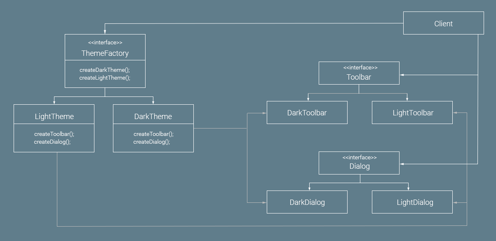
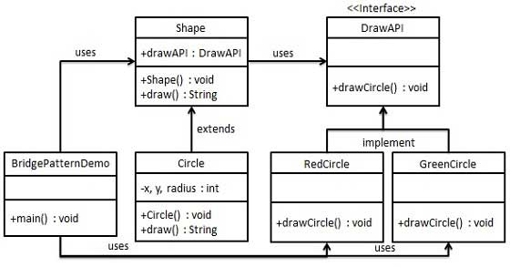

# design-pattern-notes
Design pattern notes

# Types of design patterns

## Creational Pattern
* Provide a way to create the object.
## Structural Pattern
* This design pattern  concerned with class and object composition.
## Behavioral Patterns
* Communication with objects.
## J2EE Patterns
* Concenerned with presentation layer

# Desing pattern list

## Factory Pattern
### General Note
* An creational pattern.
### Example
* A class take class type name as input and return the specific class.
* The return classes are siblings in derivation.(Generally with immediate child in the extend). 
### Personal Note

## Abstract Factory Pattern
### General Note
* An creational pattern.
* Return abstract factory instead of actual object.
### Example

Credit https://medium.com/@hitherejoe/design-patterns-abstract-factory-39a22985bdbf
### Personal Note

## Singleton Pattern
### General Note
* An creational pattern.
### Example
* Keep contructor private.
### Personal Note

## Builder Pattern
### General Note
* Example of creational pattern.
### Example

Creadit: https://www.tutorialspoint.com/design_pattern/builder_pattern.htm
### Personal Note

## Prototype Pattern
### General Note
* Creational pattern.
* Prototype pattern refers to creating duplicate object while keeping performance in mind.
* In java you can use clonable
### Example

### Personal Note

## Adapter Pattern
### General Note
* Adapter pattern works as a bridge between two incompatible interfaces. This type of design pattern comes under structural pattern as this pattern combines the capability of two independent interfaces.
### Example

### Personal Note

## Bridge Pattern
### General Note
* Bridge is used when we need to decouple an abstraction from its implementation so that the two can vary independently. This type of design pattern comes under structural pattern as this pattern decouples implementation class and abstract class by providing a bridge structure between them.
### Example

### Personal Note

## Filter Pattern
### General Note
Filter pattern or Criteria pattern is a design pattern that enables developers to filter a set of objects using different criteria and chaining them in a decoupled way through logical operations
### Example
### Personal Note

## Composite Pattern
### General Note
* Composite pattern is used where we need to treat a group of objects in similar way as a single object. Composite pattern composes objects in term of a tree structure to represent part as well as whole hierarchy. This type of design pattern comes under structural pattern as this pattern creates a tree structure of group of objects.
### Example
* Employee has subordinate of same type.
### Personal Note

## Decoratror Pattern
### General Note
* Decorator pattern allows a user to add new functionality to an existing object without altering its structure. This type of design pattern comes under structural pattern as this pattern acts as a wrapper to existing class.
### Example
### Personal Note

## Facade Pattern
### General Note
* Facade pattern hides the complexities of the system and provides an interface to the client using which the client can access the system. This type of design pattern comes under structural pattern as this pattern adds an interface to existing system to hide its complexities.
### Example

### Personal Note

## Flyweight Pattern
### General Note
* Flyweight pattern is primarily used to reduce the number of objects created and to decrease memory footprint and increase performance. This type of design pattern comes under structural pattern as this pattern provides ways to decrease object count thus improving the object structure of application.
### Example
### Personal Note

## Proxy Pattern
### General Note
* In proxy pattern, a class represents functionality of another class. This type of design pattern comes under structural pattern.
### Example
### Personal Note
